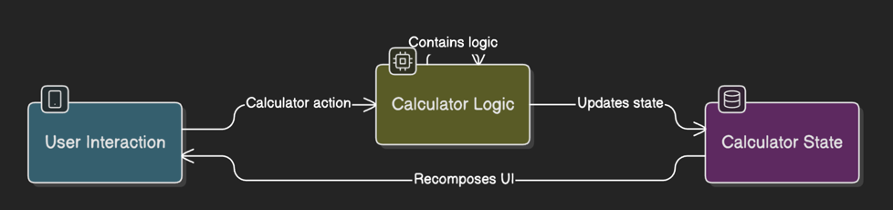

# Kotlin Compose Calculator

A simple yet functional calculator application built for Android using Kotlin and Jetpack Compose. This project demonstrates basic MVVM-like architecture principles and modern Android development practices.

## Features

*   **Basic Arithmetic Operations:** Addition, Subtraction, Multiplication, Division.
*   **Decimal Input:** Support for numbers with decimal points.
*   **Clear (AC):** Resets the entire calculation and display.
*   **Delete (Del):** Removes the last entered digit or operation.
*   **Responsive UI:** Adapts to different screen orientations.
*   **Clear Display:** Shows the current numbers and operation being entered.

## Demo
<p align="center">
  
</p>

## Tech Stack & Architecture
*   **Language:** [Kotlin](https://kotlinlang.org/)
*   **UI Toolkit:** [Jetpack Compose](https://developer.android.com/jetpack/compose) for building a declarative UI.
*   **Architecture:** Follows an MVVM-like pattern:
    *   **ViewModel (`CalculatorViewModel.kt`):** Manages the calculator's state and business logic. It exposes state to the UI and handles user actions.
    *   **State (`CalculatorState.kt`):** A data class representing the current state of the calculator (e.g., `number1`, `number2`, `operation`).
    *   **Actions (`CalculatorAction.kt`):** A sealed class defining all possible user interactions (e.g., entering a number, selecting an operation, calculating).
    *   **Operations (`CalculatorOperation.kt`):** A sealed class representing the types of mathematical operations.
    *   **UI Components (`Calculator.kt`, `CalculatorButton.kt`):** Composable functions responsible for rendering the calculator's interface.
*   **Build System:** [Gradle](https://gradle.org/)

## Project Structure

The main components of the application are located in `app/src/main/java/com/example/calculator/`:

```
.
├── Calculator.kt         # Main Composable for the calculator UI layout
├── CalculatorAction.kt   # Sealed class for user actions
├── CalculatorButton.kt   # Composable for individual calculator buttons
├── CalculatorOperation.kt# Sealed class for mathematical operations
├── CalculatorState.kt    # Data class for the calculator's state
├── CalculatorViewModel.kt# ViewModel handling logic and state
├── MainActivity.kt       # Entry point of the Android application
└── ui/theme/             # Jetpack Compose theme files (Color.kt, Theme.kt, Type.kt)
```

## Getting Started

To get a local copy up and running, follow these simple steps:

### Prerequisites

*   Android Studio (latest stable version recommended, e.g., Hedgehog, Iguana or newer)
*   Kotlin configured with Android Studio
*   An Android Emulator or a physical Android device

### Installation & Running

1.  **Clone the repository:**
    ```sh
    git clone https://github.com/alexbond008/calculator-android.git
    ```
2.  **Open the project in Android Studio:**
    *   In Android Studio, select "Open an Existing Project".
    *   Navigate to the cloned directory and select it.
3.  **Let Gradle sync:**
    Android Studio will automatically sync the project with Gradle. This might take a few minutes.
4.  **Run the application:**
    *   Select an emulator or connect a physical device.
    *   Click the "Run 'app'" button (green play icon) in Android Studio.

## How It Works

The calculator operates based on a unidirectional data flow principle, characteristic of MVVM-like architectures in Jetpack Compose, as illustrated below:

<p align="center">
  
</p>

Here's a breakdown of the flow:

1.  **User Interaction (UI):**
    *   The user taps a button on the `Calculator` UI (defined in `Calculator.kt` and `CalculatorButton.kt`).
    *   This interaction triggers an `onClick` lambda.

2.  **Calculator Action Dispatched:**
    *   The `onClick` lambda calls the `onAction` function (which is a reference to `viewModel::onAction`) passed to the `Calculator` composable.
    *   A specific `CalculatorAction` is sent to the ViewModel (e.g., `CalculatorAction.Number(5)`, `CalculatorAction.Operation(CalculatorOperation.Add)`). This represents the user's intent.

3.  **Calculator Logic (in `CalculatorViewModel.kt`):**
    *   The `CalculatorViewModel` receives the `CalculatorAction` in its `onAction` method.
    *   A `when` statement determines the type of action and calls the appropriate private function within the ViewModel (e.g., `enterNumber()`, `enterOperation()`, `performCalculation()`).
    *   These functions contain the core business logic of the calculator.

4.  **Updates State (`CalculatorState.kt`):**
    *   The logic functions within the `CalculatorViewModel` modify the `state` property.
    *   The `state` property is a `MutableState<CalculatorState>` (created using `mutableStateOf`).
    *   When its value (an instance of `CalculatorState`) is updated (typically by creating a new state object via `state.copy(...)`), Jetpack Compose is notified of the change because `MutableState` is observable.

5.  **Calculator State:**
    *   This is the single source of truth for the UI. It holds all the data needed to display the calculator screen (e.g., `number1`, `number2`, `operation`).

6.  **Recomposes UI:**
    *   The `Calculator` composable function in `Calculator.kt` observes this `state`.
    *   When the `CalculatorState` changes, Jetpack Compose intelligently recomposes (re-renders) only the parts of the UI that depend on the changed state values. This ensures the display (like the `Text` view showing numbers and operations) and button appearances are updated to reflect the new state.

*Key points managed by `CalculatorViewModel` logic:*
*   The `MAX_NUM_LENGTH` constant limits the length of numbers that can be entered.
*   Handling of decimal points.
*   Preventing multiple operations from being entered consecutively.
*   Clearing and deleting input.

---
